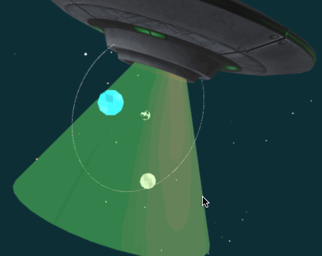
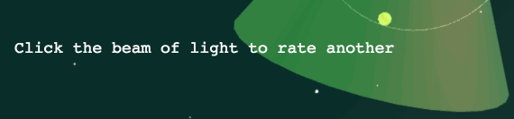
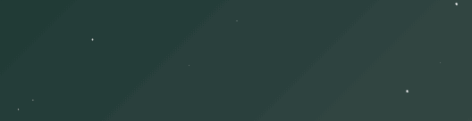
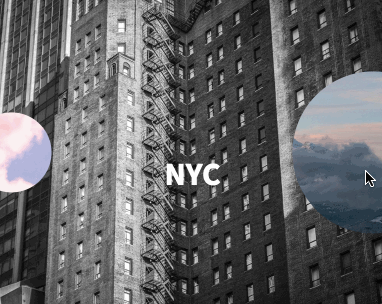
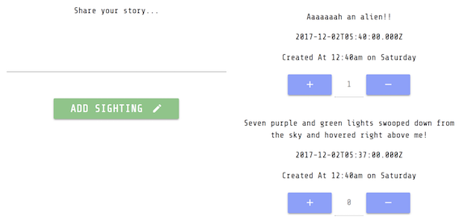
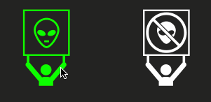

<!-- Application Name -->
<h1 align="center">UFO Catcher</h1>

<!-- App Description -->
<div align="center">Web application entices users to view official UFO sighting reports and determine them to be, in fact, "alien," or bogus, "not alien" claims. <em>Do you believe?...</em></div>


## Contents
  - [Contents](#contents)
    - [Deployed Application](#deployed-application)
    - [Inspiration](#inspiration)
    - [Roles](#roles)
    - [Technologies Used](#technologies-used)
    - [Concept & Motivation](#concept-motivation)
    - [Challenges](#challenges)
    - [Future Features](#future-features)
    - [Credits](#credits)


## Deployed Application
[Heroku] https://fast-eyrie-14169.herokuapp.com/


## Inspiration
National UFO Reporting Center "UFO Sightings" Database

[Kaggle] https://www.kaggle.com/NUFORC/ufo-sightings


## Roles
  * Jessica Lin - Co-COO, UI Director, Back-end
    * Threejs & environment design
    * Chart.js & required API-routes
    * Navigation bar
  * Laura Boetcher - Co-COO, Back-end, SVG Apprentice
    * Sequelize API-routes for voting
    * Voting functionality
    * Session-based vote log


## Technologies Used
  Node, Express, MySQL, Sequelize, Threejs, Chart.js, Maya (JsonLoader), SVG, jQuery, Javascript, CSS, HTML


## Concept & Motivation
  * Voting
    <!-- * Laura -->
  * Feel (music/visuals)
    <!-- * Jess -->
  * Text (ASCII/terminal look)
    <!-- * Laura -->
  * Discovery
    <!-- * Jess -->


## Challenges

### Threejs


### Sequelize


### Cursor
  ###### Hand cursor on mouse hover
  

### Animated Effects
  ###### Glitch effect on application title
  
  ***
  ###### Glitch effect on message
  
  ***
  ###### Snackbar popup "vote logged"
  


#### Abandoned elements
  * Upvote (jQuery plugin)
  * NProgress (javascript progress bar)
  * Transitions with Barba.js
  * User-submitted data
  * Animated screen loader
  * SVG button effects

  ###### Transitions with Barba.js  
  
  ***

  ###### User-submitted data
  
  ***

  ###### Animated SVG "cow loader"
  
  ***

  ###### SVG with gitch effect
   
  ***
  
  ###### SVG in `<object>` tag, uses CSS `fill` property on hover
  

  <!-- ```
  //Get element in object tag
  var a = document.getElementById("alien_nofill");
  //Get SVG element inside object tag
  var svgDoc = a.contentDocument;
  //Get SVG item by name
  var svgItem = svgDoc.getElementById("alien_nofill_item");
  //Target SVG to change fill color on hover
  $(svgItem).hover(function() {
    $(this).attr("fill", "#76ff03");
  }, function() {
    $(this).attr("fill", "#fff");
  });
  ``` -->


## Future Features
  * User authentication
    * User can mark favorite entries
    * User can add own sighting data
    * User can fork comments, edit for spelling, etc.
  * Expanded chart options
    * More data choices
    * User-selected data content
  * Newspaper image generator
    * Render headlines of favorite/ most popular entries
    * Shareable/printable
  * Interactive graphics
    * Spacecraft changes color, lighting, etc.
    * Little green men to make appearances
    * Additional clickable elements
  * eCommerce integration
    * "I Voted" stickers
    * Fashionable aluminum hats
    * "UFO Catcher" branded binoculars, t-shirts, etc.


### Credits
  * CSS Glitch Effect by Chris Coyier (https://codepen.io/chriscoyier/pen/yqHxB)
  * Interactive Solar System by  Nikita Skargovskii (https://codepen.io/nikita_ska/pen/bqNdBj)
  * Music from Ambient Epicuros (https://www.youtube.com/watch?v=ORNfEC1q2EU&t=511s)
  * Banner Alien Icons by corpus delicti on Noun Project (https://thenounproject.com/term/banner-alien/1040564/)
  * StackOverflow
  * Codyhouse
  * CodePen
  * And thank you curious aliens for visiting Earth :alien: :rocket: :stars:
